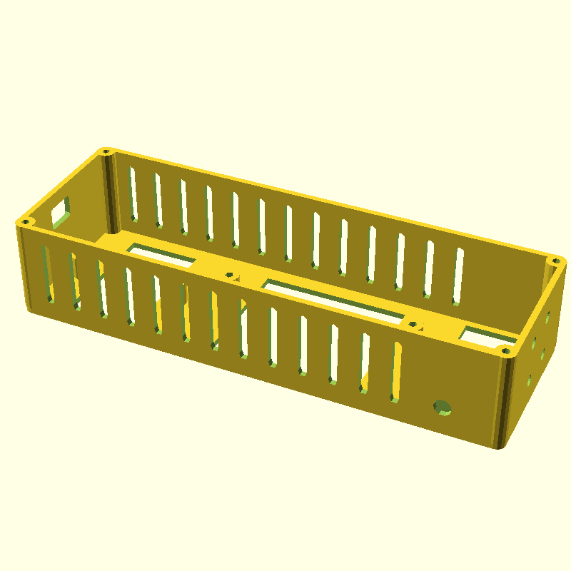
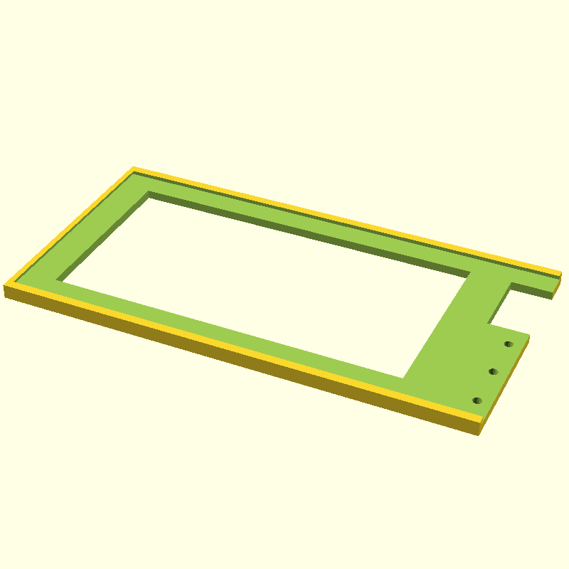
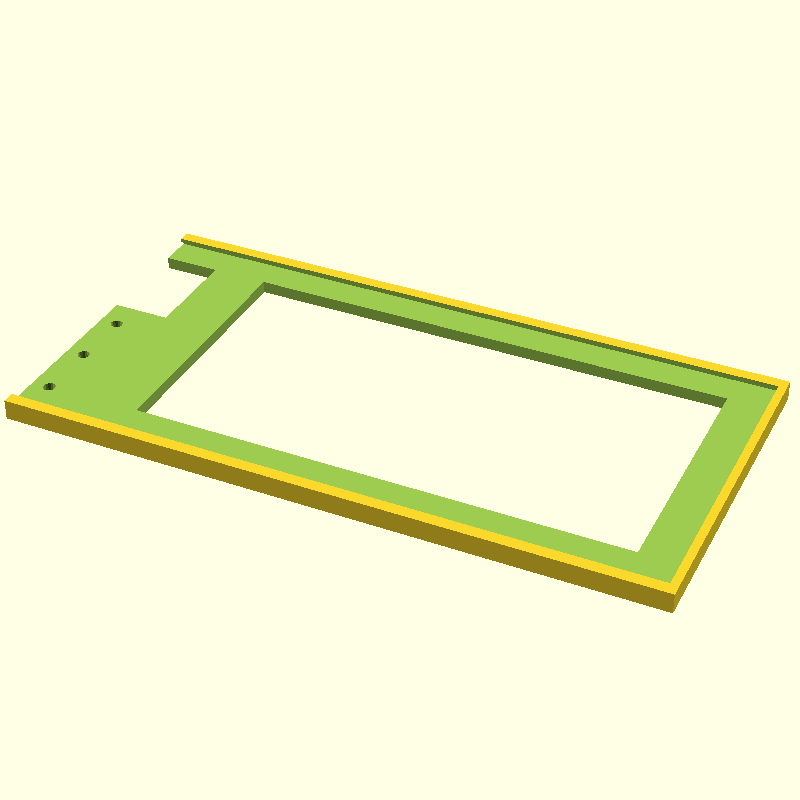
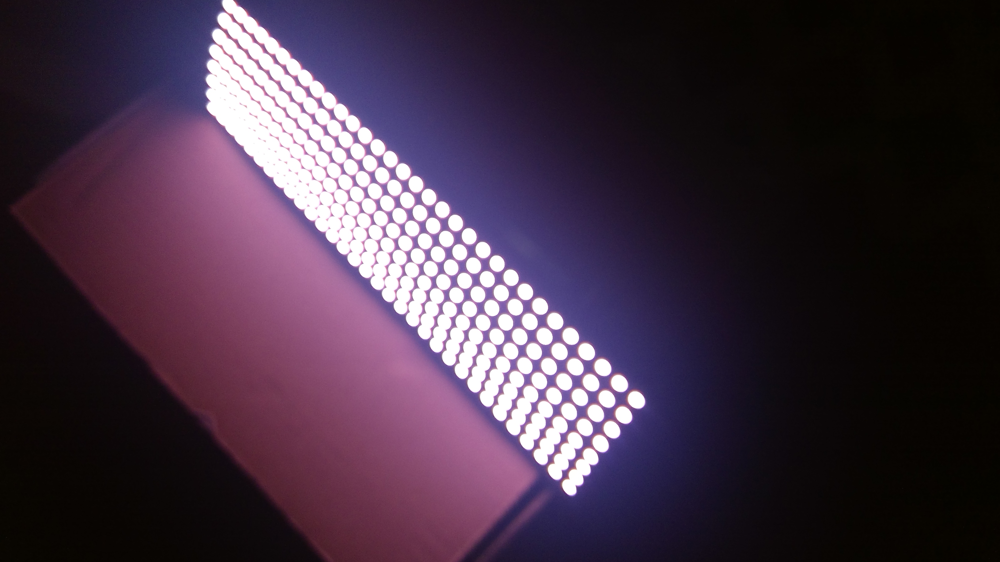
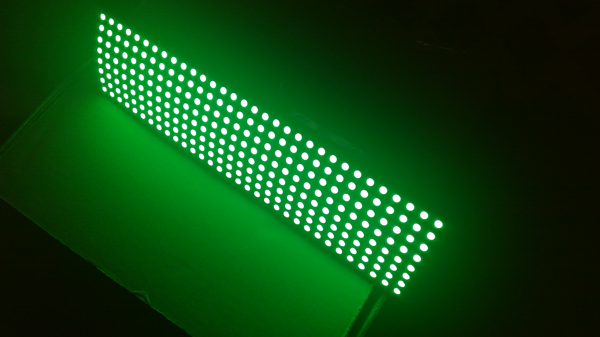
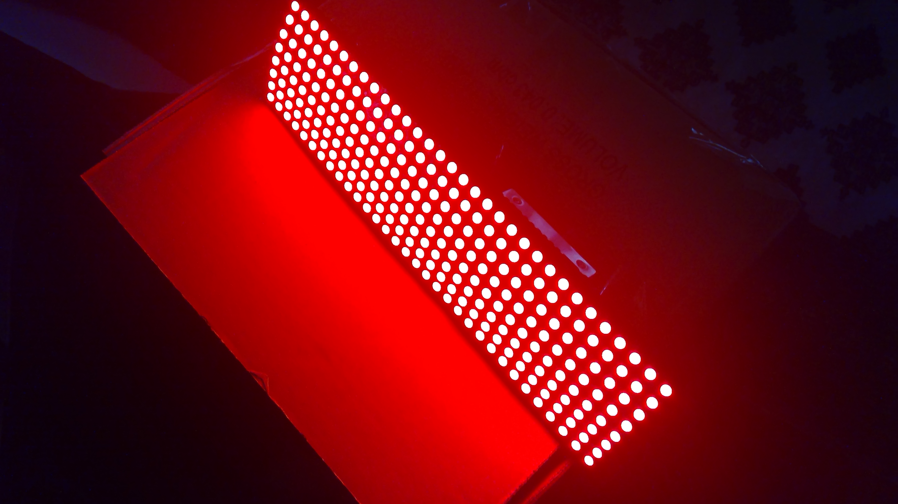
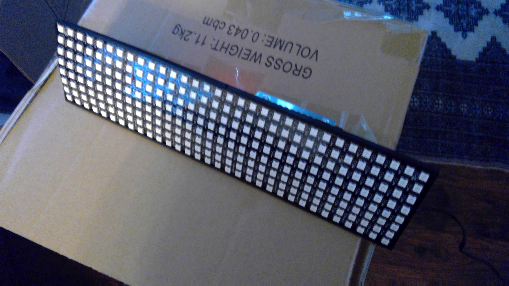
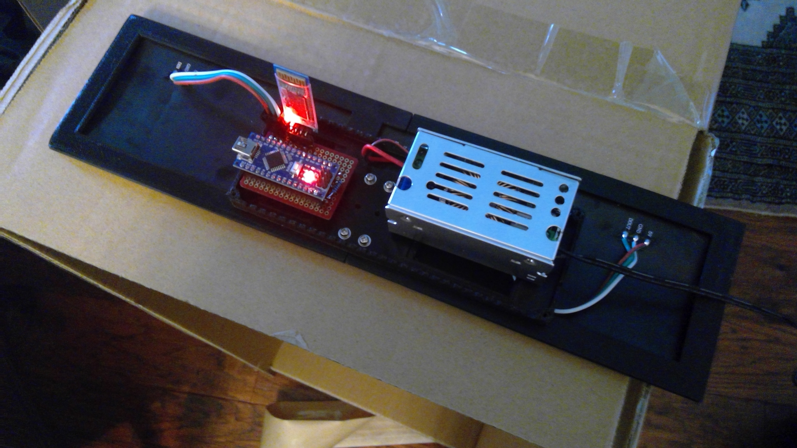
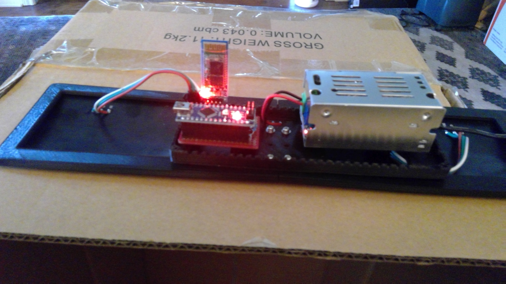

# LED light panel
So, I put my new Creality Ender 3 v2 in an enclosure. Now my PiCam can't see anything, so I needed some light. Since I love to tinker, I decided to build a LED light source for inside the enclosure.

I found a 8x32 LED panel [ACEIRMC 2pcs WS2812 5050SMD Individual Addressable 8X32 256 Pixels LED Matrix](https://www.amazon.com/dp/B08XZHRV3S?th=1), under $20 each. 

## The 3d printed stuff

Since the panel was flexible, I needed a frame to hold it. This led to the beginning of a 3d print project. The SCAD files are in the models folder.
The parts consit of two halves for the light panel and a control box for the power supply and the microcontroller.

NOTE: There currently is no cover for the control box.

## The electronics

The brains of the light panel is an Arduino Nano v3. The power supply is a [Teyleten Robot 100W 6A DC-DC Buck Converter 10-90V](https://www.amazon.com/dp/B09FNBSZTR) which is way more power than required, but it has the capability to handle the 48V output available from the Ender 3's power supply and can handle enough current for the LED panel.

Connnection to the Raspberry Pi running [Octoprint](https://octoprint.org/) was originally going to be serial over USB, but there were two problems, another cable, and 5v from the Pi colliding with 5v from the high power powersupply. To solve this issue, add an HC06 bluetooth dongle.

## The software

The original idea was just to have th Arduino set all of the LEDs to max white and let it go. Where is the fun in that? After playing with several of the [FastLED](https://fastled.io/) examples, more colors and different settings were needed.

A simple command set was needed to allow for changing the color and intensity of the LEDs. This simple command set only supports setting the entire panel to one color, although it is possible for the Nano to set color for each LED individually.

The communication with the bluetooth dongle is via [AltSoftSerial](https://www.arduino.cc/reference/en/libraries/altsoftserial/). Since FastLED can hold the atmel processor for about 1.6ms to update the panel and AltSoftSerial is only able to delay an interrupt by about 1 bit time, the command set would have to be very simple.

There are currently two commands:

| Command|Usage | Description |
| -- | -- | -- |
| i | iddd | Set the intensity, replace ddd with a value between 0-100 to set intensity percentage. |
| c | cRRGGBB | Set the color of the panel, RRGGBB is the hex value for the RGB color. |

The commands are received via the RFCOMM interface. Each character is echoed back and the result, 0, 1, or -1 is returned. -1 indicates the command was not understood. 1 indicates the command failed, and 0 indicates the command was successful. The LED panel is updated on one second intervals, so the command may take up to a second to take effect.

## Pictures

These are pictures of the prototype control box. This was the original control box with the print stopped at about 4mm in height. This allowed a test assembly, which resulted in modifications. The control box SCAD file contains a control box which has been modified as a result of this test fitting.

Panel after initial power-on.

Panel after receiving 'c00ff00' command.

Panel after receiving 'cff0000' command.

Panel when unpowered.

Back view of panel.

Side view of panel.

